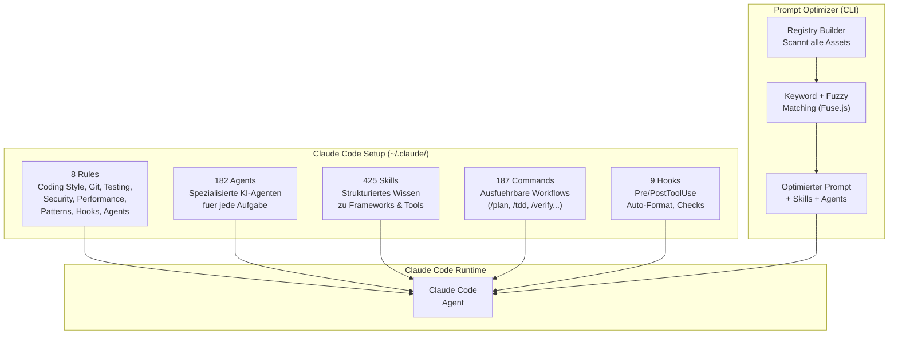
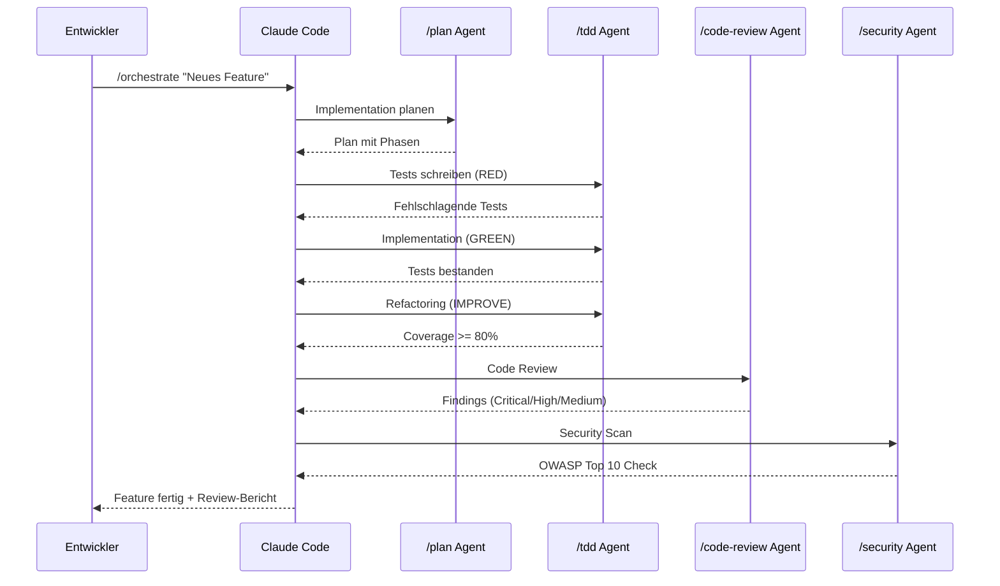
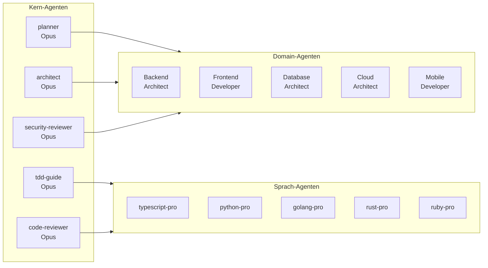
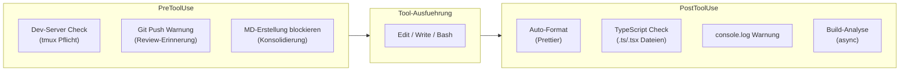

# My Claude Code Setup

Persoenliche Claude Code Konfiguration mit 425 Skills, 182 Agents, 187 Commands, 8 Rules und 9 Hooks. Inklusive Prompt Optimizer CLI zur intelligenten Prompt-Anreicherung.

---

## Architektur



## Workflow-Orchestrierung



## Agent-Hierarchie



## Hook-Pipeline



---

## Inhalt

| Komponente | Anzahl | Beschreibung |
|---|---|---|
| Skills | 425 | Strukturiertes Wissen (API, Frontend, Backend, Cloud, AI...) |
| Agents | 182 | Spezialisierte Agenten (Opus/Sonnet/Haiku) |
| Commands | 187 | Ausfuehrbare Workflows (/plan, /tdd, /verify...) |
| Rules | 8 | Entwicklungsstandards (Coding Style, Git, Testing, Security) |
| Hooks | 9 | Automatische Checks (Format, Types, Build, Security) |

---

## Wichtige Commands

```
/plan               - Implementation planen
/tdd                - Test-Driven Development
/verify             - Build + Types + Lint + Tests + Secrets
/code-review        - Security + Quality Review
/orchestrate        - Chain: plan -> tdd -> review -> security
/full-stack-feature - End-to-End Backend + Frontend + DB
/smart-debug        - KI-gestuetztes Debugging
/build-fix          - Build-Fehler inkrementell beheben
/security-sast      - Multi-Language Security Scan
/frontend-dev       - Closed-Loop Visual Frontend Testing
```

---

## Rules

| Regel | Kern-Prinzip |
|---|---|
| coding-style | Immutability, kleine Dateien (max 800 Zeilen), explizites Error Handling |
| git-workflow | Conventional Commits, PR-Workflow, Feature-Phasen |
| testing | 80% Coverage Pflicht, TDD (RED -> GREEN -> IMPROVE) |
| security | Keine Hardcoded Secrets, OWASP Top 10, Input Validation |
| performance | Model-Auswahl (Haiku/Sonnet/Opus), Context Window Management |
| patterns | Repository Pattern, API Response Envelope, Skeleton Projects |
| hooks | PreToolUse/PostToolUse, TodoWrite Best Practices |
| agents | Parallele Ausfuehrung, Multi-Perspektiven-Analyse |

---

## Model-Strategie

| Modell | Einsatz | Kosten |
|---|---|---|
| Haiku 4.5 | Leichte Agenten, Pair Programming | 3x guenstiger |
| Sonnet 4.5 | Haupt-Entwicklung, Orchestrierung | Standard |
| Opus 4.5 | Architektur, tiefes Reasoning | Premium |

---

## Installation

```bash
# 1. Repository klonen
git clone https://github.com/manufarbkontrast/my-claude-setup.git
cd my-claude-setup

# 2. In ~/.claude/ kopieren
cp -r skills/* ~/.claude/skills/
cp -r agents/* ~/.claude/agents/
cp -r commands/* ~/.claude/commands/
cp -r rules/* ~/.claude/rules/
cp settings.json ~/.claude/settings.json

# 3. Prompt Optimizer installieren (optional)
npm install
npm link
```

### Prompt Optimizer nutzen

```bash
prompt-optimizer "Shopify Store bauen"
po "React Dashboard mit Supabase"
po --stats    # Registry-Statistiken
po --build    # Registry neu aufbauen
```

---

## Voraussetzungen

- Node.js >= 20
- Git
- Claude Code CLI

---

## Quellen

Kuratiert aus:

- [affaan-m/everything-claude-code](https://github.com/affaan-m/everything-claude-code) - Core Workflow, TDD, Hooks
- [anthropics/skills](https://github.com/anthropics/skills) - Offizielle Anthropic Skills
- [wshobson/agents](https://github.com/wshobson/agents) - 112 Agents, 146 Skills, 91 Commands
- [secondsky/claude-skills](https://github.com/secondsky/claude-skills) - 176 Skills (Cloudflare, Nuxt, TanStack, Bun)
- [anthropics/claude-code](https://github.com/anthropics/claude-code) - Frontend-Design Plugin
- [mrgoonie/claudekit-skills](https://github.com/mrgoonie/claudekit-skills) - Shopify, Payment, Debugging
- [hemangjoshi37a/claude-code-frontend-dev](https://github.com/hemangjoshi37a/claude-code-frontend-dev) - Visual Testing
